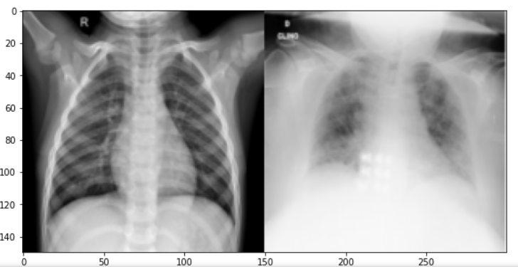
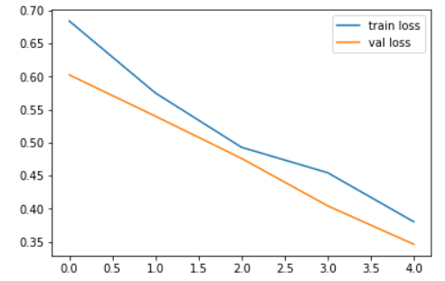
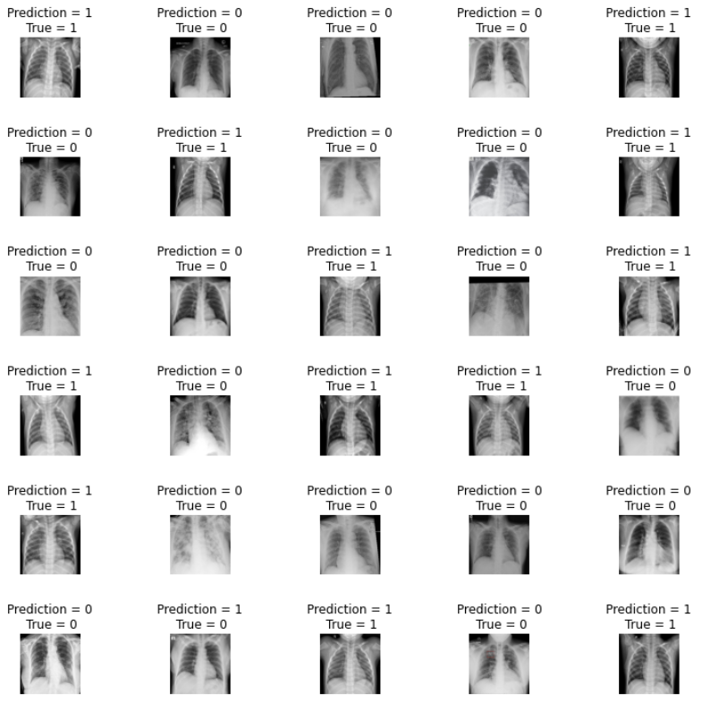
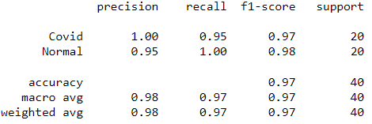
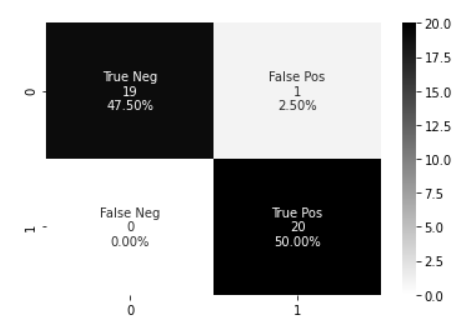

# Corona Virus Recognition Using Chest X Ray (CXR) Images

One of the critical factors behind the rapid spread of COVID-19 
pandemic is a lengthy clinical testing time. 
The imaging tool, such as Chest X-ray (CXR), can speed up the 
identification process. Therefore, our objective is to develop an 
automated CAD system for the detection of COVID-19 samples from 
healthy and covid cases using CXR images.

## 📖Dataset Link
https://drive.google.com/file/d/1unlFh65lUUUXtknOvlhIZlagFrfFXh6M/view?usp=sharing

## 🛠Libraries Required

| Library   | Version  |
| :-------- | :------- |
| `NumPy` | `1.21.5+vanilla` |
| `Matplotlib` | `3.5.1` |
| `Seaborn` | `0.11.2` |
| `OpenCV` | `4.5.5.62` |
| `Scikit-learn` | `1.0.2` |
| `Scikit-Image` | ` 0.19.2` |
| `Tensorflow` | `2.8.0` |

## 📸Outputs
* Normal person CXR image (right) and Covid infected person CXR image (left)

* Loss Graph     

* Accuracy Graph       

* Predicted VS True      

* Classification Report         

* Confusion Matrix          

## 🔗 Social
You can connect with me here 😀    

